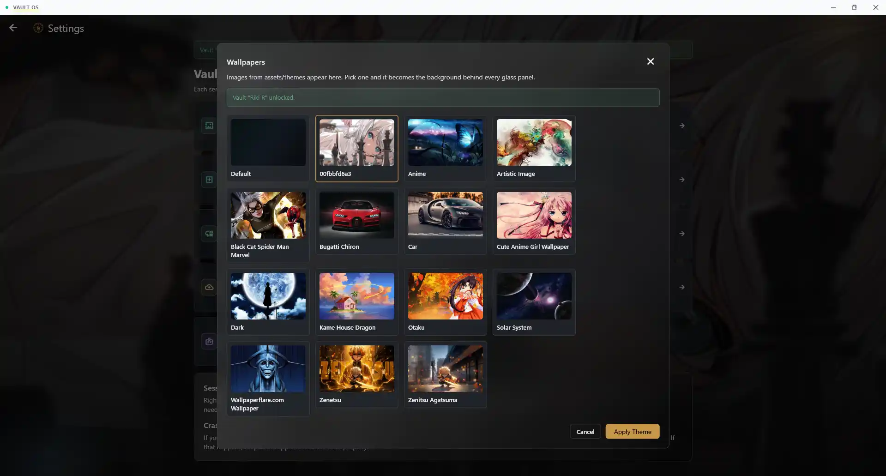
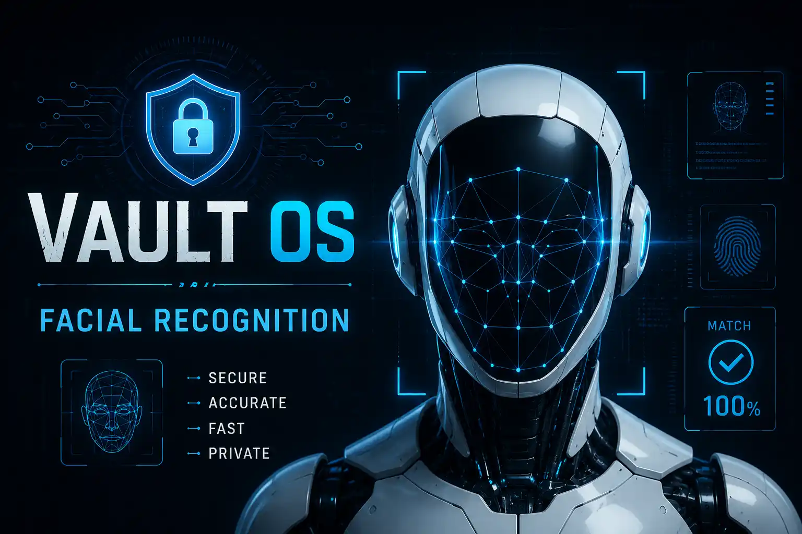
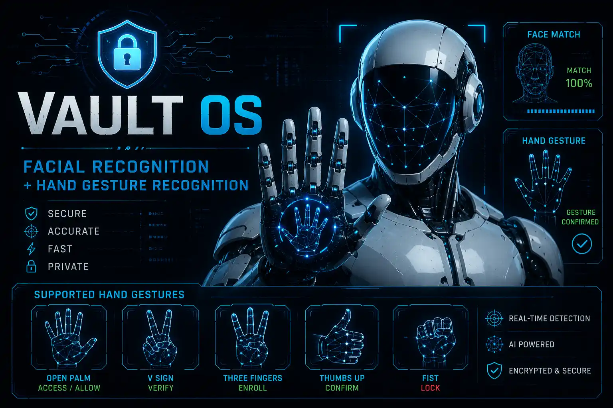
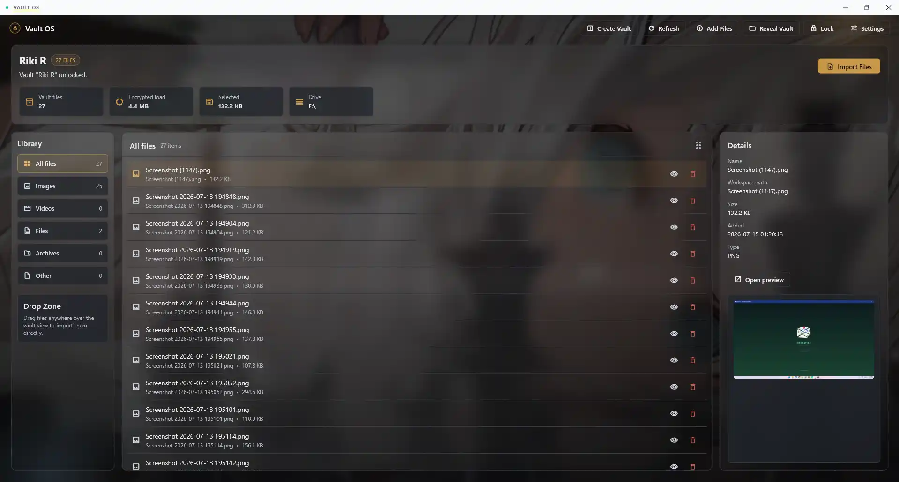
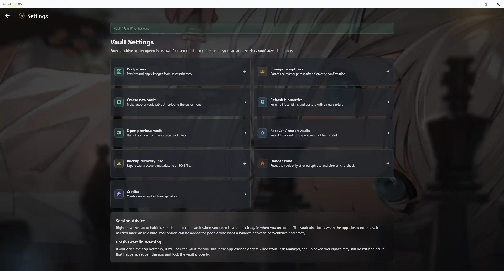

# Vault OS


Vault OS is a local-first desktop vault for Windows.

It lets you create hidden vaults on your own machine, lock them with a master passphrase, and add biometric checks like:

- face match
- double blink
- custom hand gesture

When you unlock the vault, it opens a working space for your files.  
When you lock it again, everything gets encrypted back into the hidden vault folder.

Simple idea: your files stay with you, not on someone else's server.

## Why I Made This

I first made Vault OS for myself.

I wanted something that:

- stays local
- works without internet
- does not need an account
- feels private
- does not depend on cloud syncing

Then I thought, if I already want this for myself, maybe other people want the same thing too.

So I decided to make it open and share it.

## What Vault OS Does

Vault OS helps you:

- create one or more hidden vaults
- use passphrase + biometrics to unlock them
- import files into the vault workspace
- lock everything back into encrypted storage
- switch between multiple vaults
- rescan and recover vaults if local app state is lost
- change passphrase, refresh biometrics, and manage wallpapers from settings

## How It Works

Each vault stores:

- encrypted file blobs
- encrypted registry data
- encrypted biometric profile data
- recovery info needed to reconnect the vault later

Unlock flow:

1. Choose a vault
2. Enter the passphrase
3. Complete face verification
4. Blink twice
5. Hold the enrolled hand gesture
6. Vault workspace opens

Lock flow:

1. Workspace contents are packed back into the vault
2. Metadata is updated
3. The unlocked workspace is cleared

## Screenshots

I will keep adding screenshots here as the app grows.

### Theme Collection

Theme picker with built-in wallpaper options.



### Face Scan

Face verification flow during enrollment or unlock.



### Gesture Enrollment

Custom gesture capture using the webcam.



### Vault Home

Main vault workspace with file library, details, and actions.



### Settings

Settings screen for wallpapers, security, recovery, and vault tools.



## Current Stack

- Flutter
- Dart
- Python
- OpenCV
- MediaPipe
- ONNX Runtime
- Windows desktop runner

## Current Platform

- Windows supported now
- macOS not done yet

If you want a macOS version too, message me on Instagram: **[@riki_vivek](https://instagram.com/riki_vivek)**  
If enough people want it, I will work on that too.

## Releases

I will upload ready-to-use app builds in the **GitHub Releases** section.

So if you do not want to set up Flutter and Python manually, you can just:

1. go to Releases
2. download the release zip
3. extract it
4. run the app

That will be the easiest way for normal users.

## Project Setup

If you want to run the project from source, follow this step by step.

### 1. Install Flutter

Install Flutter for Windows:

- [Flutter Windows install guide](https://docs.flutter.dev/get-started/install/windows)

Then make sure this works:

```powershell
flutter --version
```

### 2. Enable Windows Desktop Support

```powershell
flutter config --enable-windows-desktop
flutter doctor
```

### 3. Install Visual Studio Build Tools

For Flutter Windows apps, you need Visual Studio with the **Desktop development with C++** workload.

If Flutter Doctor complains about Windows toolchain, fix that first.

### 4. Install Python

Install Python 3.10 or newer:

- [Python downloads](https://www.python.org/downloads/windows/)

During install, turn on:

- `Add Python to PATH`

Then check:

```powershell
python --version
```

### 5. Clone The Project

```powershell
git clone https://github.com/CraftedWebPro/vault-os.git
cd vault-os
```

### 6. Install Flutter Packages

```powershell
flutter pub get
```

### 7. Install Python Packages

```powershell
cd python_service
pip install -r requirements.txt
cd ..
```

### 8. Add The Required Model Files

Place these files inside:

```text
python_service/models/
```

Required files:

- `face_landmarker.task`
- `hand_landmarker.task`
- `face_embedding.onnx`

The face embedding model is used for:

- face alignment
- embedding extraction
- cosine similarity matching

One example source used for the face model:

- [OpenVINO ArcFace ONNX model](https://storage.openvinotoolkit.org/repositories/open_model_zoo/public/2022.1/face-recognition-resnet100-arcface-onnx/arcfaceresnet100-8.onnx)

After download, rename it to:

```text
face_embedding.onnx
```

### 9. Run The App

From the project root:

```powershell
flutter run -d windows
```

## First-Time Use

1. Open the app
2. Create a vault name
3. Choose a parent folder
4. Continue to security
5. Set a master passphrase
6. Start webcam enrollment
7. Align your face
8. Blink twice
9. Hold your chosen gesture
10. Vault opens

## Importing Files

You can add files by:

- drag and drop
- `Add Files`
- `Import Files`

Files go into the unlocked workspace first, then back into encrypted storage when locked.

## Recovery / Rescan

If local app state is lost but your vault folders still exist:

1. open the app
2. choose recovery / rescan
3. select the folder to scan

You can also do this later from Settings.

## Important Notes

- deleting app state does not automatically delete your vault data
- deleting the actual vault folder destroys the data
- renaming or manually editing vault files can break unlock or recovery
- this app protects privacy, but it cannot recover files if the vault folder itself is deleted

## Troubleshooting

### Python not found

Make sure this works:

```powershell
python --version
```

### Webcam not working

Check these:

- webcam is not being used by another app
- Python dependencies are installed
- all required model files are present inside `python_service/models/`

### File picker or native window changes not updating

Do a full restart:

```powershell
flutter clean
flutter pub get
flutter run -d windows
```

### Recovery does not find the vault

- choose the exact vault folder or its parent folder
- make sure the vault files still exist on disk

## Repo Notes

This repo does not track local-only folders and big runtime files such as:

- `.codebase-memory/`
- `codebackup/`
- `md_files/`
- `python_service/models/`
- Python cache files

That is done on purpose so the repo stays clean.

## Folder Overview

- `lib/` -> Flutter UI, controllers, services, models
- `python_service/` -> biometric service and model integration
- `assets/themes/` -> wallpapers
- `assets/images/` -> logos and static images
- `assets/json/` -> lottie and animation files

## Support

If you like the project, use it, test it, or share it.

If you want to reach me:

- Instagram: **[@riki_vivek](https://instagram.com/riki_vivek)**

## License

This project is licensed under the **PolyForm Noncommercial License 1.0.0**.

So people can use it, learn from it, and modify it for non-commercial use. Just do not turn it into a business and start selling my vault's gym homework.

See [LICENSE](LICENSE) for full details.
