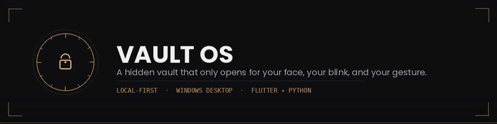
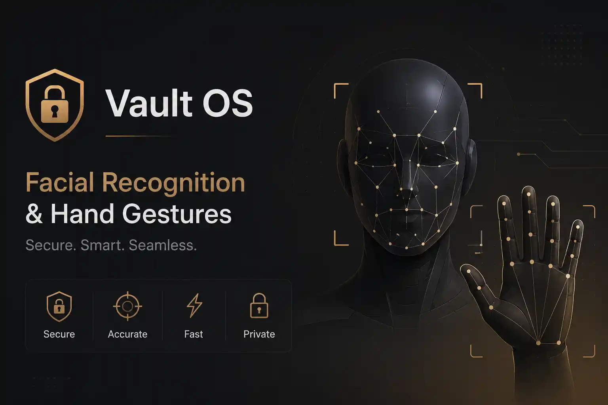

<p align="center">
  
</p>

<p align="center">
  
  
  
  
  
</p>

<p align="center">
  A local-first, hidden vault for Windows — unlocked by your passphrase, your face, your blink, and a gesture only you know.<br />
  No cloud. No account. No breach notice six months from now.
</p>

<p align="center">
  <a href="https://github.com/CraftedWebPro/vault-os/releases/latest/download/VaultOS-Setup.exe">
    
  </a>
  &nbsp;
  <a href="https://github.com/CraftedWebPro/vault-os/releases/latest">
    
  </a>
</p>

| | |
|---|---|
| **Platform** | Windows 10/11 (64-bit) |
| **Latest version** | [v1.0.3](https://github.com/CraftedWebPro/vault-os/releases/tag/1.0.3) |
| **Installer size** | ~71 MB |
| **Download** | [VaultOS-Setup.exe](https://github.com/CraftedWebPro/vault-os/releases/latest/download/VaultOS-Setup.exe) |

---

## Table of Contents

- [Why](#why)
- [What It Does](#what-it-does)
- [How It Works](#how-it-works)
- [Screenshots](#screenshots)
- [Stack](#stack)
- [Install](#install)
- [Run From Source](#run-from-source)
- [First-Time Use](#first-time-use)
- [Important Notes](#important-notes)
- [Troubleshooting](#troubleshooting)
- [Security Model](#security-model)
- [Support](#support)
- [License](#license)

---

## Why

Every "private" cloud vault I tried still wanted an account, an internet connection, or my trust — usually all three. So I built one that stays fully local, needs no sign-up, and opens only for my face, my blink, and a gesture only I know.

If you want the same thing, here it is.

## What It Does

- Creates one or more hidden, encrypted vaults
- Unlocks with a passphrase **and** biometrics (face, blink, gesture)
- Imports files into a working vault space, re-encrypts on lock
- Supports multiple vaults, rescanning, and recovery
- Lets you change your passphrase, refresh biometrics, and manage wallpapers

## How It Works

Each vault stores encrypted file blobs, encrypted registry/biometric data, and recovery info.

**Unlock:** choose vault → enter passphrase → face verification → double blink → hand gesture → workspace opens.

**Lock:** workspace re-encrypted → metadata updated → workspace wiped clean.

It's either sealed or open — nothing in between.

## Screenshots

| | |
|---|---|
| **Theme Collection** — built-in wallpaper picker |  |
| **Biometric Scan** — face, blink, and hand gesture in one webcam session |  |
| **Vault Home** — file library, details, actions |  |
| **Settings** — wallpapers, security, recovery |  |

## Stack

Flutter · Dart · Python · OpenCV · MediaPipe · ONNX Runtime · Windows desktop runner

**Platform:** Windows is supported now. macOS isn't done yet — if you want it, message me on Instagram: [@riki_vivek](https://instagram.com/riki_vivek).

## Install

Grab the installer and run it — it handles Python packages, model files, and shortcuts for you:

**[Download VaultOS-Setup.exe](https://github.com/CraftedWebPro/vault-os/releases/latest/download/VaultOS-Setup.exe)**

See the [release notes](https://github.com/CraftedWebPro/vault-os/releases/latest) for what's new.

Want to run from source instead? Keep reading.

## Run From Source

1. **Install Flutter** — [Windows guide](https://docs.flutter.dev/get-started/install/windows), then confirm with `flutter --version`
2. **Enable Windows desktop support**
   ```powershell
   flutter config --enable-windows-desktop
   flutter doctor
   ```
3. **Install Visual Studio Build Tools** — the "Desktop development with C++" workload. Fix any `flutter doctor` complaints here first.
4. **Install Python 3.10+** — [python.org](https://www.python.org/downloads/windows/), check "Add Python to PATH" during install, confirm with `python --version`
5. **Clone and install dependencies**
   ```powershell
   git clone https://github.com/CraftedWebPro/vault-os.git
   cd vault-os
   flutter pub get
   cd python_service && pip install -r requirements.txt && cd ..
   ```
6. **Add model files** to `python_service/models/`: `face_landmarker.task`, `hand_landmarker.task`, `face_embedding.onnx`. These aren't in the repo — they're large, and you should pick a source whose license you've actually checked. One option: [OpenVINO ArcFace ONNX model](https://storage.openvinotoolkit.org/repositories/open_model_zoo/public/2022.1/face-recognition-resnet100-arcface-onnx/arcfaceresnet100-8.onnx), renamed to `face_embedding.onnx`.
7. **Run it**
   ```powershell
   flutter run -d windows
   ```
   If it asks you to create a vault, you're set.

## First-Time Use

Open the app → name your vault → pick a parent folder → set a master passphrase → enroll your face (align, blink twice) → hold your gesture → vault opens.

About 90 seconds in practice, mostly just holding still for the webcam.

Files go in via drag-and-drop or `Import Files`. They sit in the unlocked workspace and get re-encrypted the moment you lock the vault.

If your app state is ever lost but your vault folder still exists on disk, use **Recovery / Rescan** (on first launch or from Settings) and point it at the vault folder.

## Important Notes

- Deleting the app's local state does **not** delete your vault data.
- Deleting the actual vault folder **does** destroy it — no undo.
- Don't rename or hand-edit vault files; it can break unlock or recovery.
- Treat the vault folder like the only copy of something important, because it is.

## Troubleshooting

**Errors during unlock are intentional.** Wrong passphrase, missed blink, drifted gesture — Vault OS would rather reject you ten times than let the wrong person in once. Read the error, fix it, retry.

**Python not found** — run `python --version` to confirm it's installed and on PATH. If using the installer, biometric features stay disabled until Python is installed from [python.org](https://www.python.org/downloads/windows/).

**Webcam not working** — close other apps using it, confirm Python dependencies are installed, and check that all three model files are in `python_service/models/`.

**UI not updating / file picker issues** — full restart:
```powershell
flutter clean
flutter pub get
flutter run -d windows
```

**Recovery can't find the vault** — point it at the exact vault folder (or its parent), and confirm the vault files still exist on disk.

## Security Model

Vault OS uses AES-256-GCM encryption with PBKDF2-HMAC-SHA256 key derivation (120k iterations). The vault key is constructed as `XOR(passphrase-derived key, biometric key)`, so both factors are required to decrypt.

See **[SECURITY.md](SECURITY.md)** for the full threat model, encryption details, key derivation parameters, biometric profile storage, attack surface analysis, and brute-force considerations.

## Support

Using it, testing it, or sharing it is genuinely all the support I need.

- Instagram: [@riki_vivek](https://instagram.com/riki_vivek)
- [GitHub Sponsors](https://github.com/sponsors/CraftedWebPro) — no pressure, no paywall

## License

**PolyForm Noncommercial License 1.0.0** — use it, learn from it, modify it for non-commercial use. See [LICENSE](LICENSE) for details.